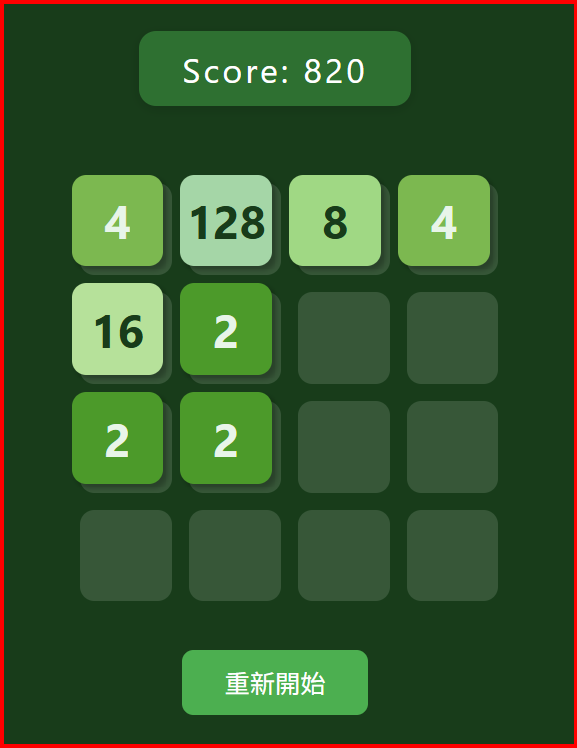

# 2048 Game

A browser-based implementation of the popular 2048 puzzle game. Combine matching numbers to reach the 2048 tile!

  
*Screenshot of the game in action*

## Features

- Clean, responsive UI with smooth animations
- Score tracking
- Game over detection
- Restart functionality
- Keyboard controls (arrow keys)

## How to Play

1. Use the **arrow keys** to move all tiles in that direction
2. When two tiles with the same number touch, they merge into one
3. After each move, a new tile (2 or 4) appears in a random empty cell
4. The game ends when there are no more moves possible
5. Try to reach the 2048 tile!

## Getting Started

### Prerequisites

- A modern web browser (Chrome, Firefox, Safari, Edge, etc.)

### Installation

1. Clone the repository:
   ```bash
   git clone https://github.com/yshung1971/2048-game.git
   ```
2. Navigate to the project directory
3. Open `index.html` in your web browser

## Game Controls

- **Arrow Keys (↑, →, ↓, ←)**: Move tiles in the corresponding direction
- **Restart Button**: Start a new game

## Project Structure

- `index.html` - Main HTML file
- `game.js` - Game logic and rendering

## Contributing

Contributions are welcome! Feel free to submit issues and pull requests.

## License

This project is open source and available under the [MIT License](LICENSE).

## Acknowledgments

- Original game by Gabriele Cirulli
- Inspired by 1024 by Veewo Studio
